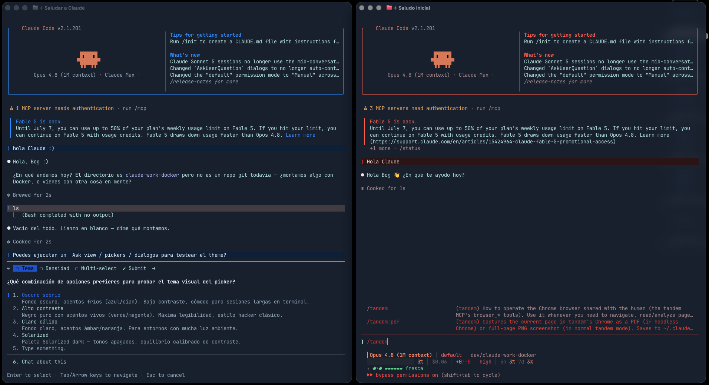

# claude-code-themes

Tres temas de color para la CLI de [Claude Code](https://claude.com/claude-code)
más una **statusline** de tres bandas con un bicho a la derecha que refleja el
estado real de la sesión.

| Tema | Acento | Look |
| --- | --- | --- |
| **Terminal** | `#4dd6c1` turquesa | un color por tipo de dato: rutas, identificadores, urls, números, modos |
| **Blood Red** | `#ff5c47` coral | cálido: coral, terracota, vino sobre fondo oscuro |
| **Electric Blue** | `#2e8bff` azul | frío: cian, azure, azul profundo sobre fondo oscuro |



*Izquierda: **Electric Blue** (prompts, picker y selección en azul). Derecha:
**Blood Red** (prompts coral y la statusline de 3 líneas con el indicador de vida
de sesión).*

## Contenido

- `themes/terminal.json` — tema por tipo de dato, el que empareja con la statusline
- `themes/blood-red.json` — tema cálido instalable vía `/theme`
- `themes/electric-blue.json` — tema frío instalable vía `/theme`
- `statusline.sh` — statusline de tres bandas con el bicho
- [`VIDA.md`](VIDA.md) — qué mide el bicho, en detalle

## Instalación

### 1. Temas de color

```bash
mkdir -p ~/.claude/themes
cp themes/terminal.json      ~/.claude/themes/terminal.json
cp themes/blood-red.json     ~/.claude/themes/blood-red.json
cp themes/electric-blue.json ~/.claude/themes/electric-blue.json
```

Dentro de una sesión de Claude Code, ejecuta `/theme` y elige el que quieras.
Recargan en caliente al editar el JSON (no hace falta reiniciar).

O actívalo directamente en `~/.claude/settings.json`:

```json
{
  "theme": "custom:terminal"
}
```

> El slug (`custom:<slug>`) sale del **nombre del archivo** sin `.json`, no del
> campo `"name"`. `blood-red.json` → `custom:blood-red`.

### 2. Statusline

```bash
cp statusline.sh ~/.claude/statusline.sh
chmod +x ~/.claude/statusline.sh
```

Añade (o mergea) en `~/.claude/settings.json`:

```json
{
  "statusLine": {
    "type": "command",
    "command": "~/.claude/statusline.sh",
    "hideVimModeIndicator": true,
    "refreshInterval": 1
  }
}
```

La statusline solo necesita `python3` (usa la librería estándar; nada de `jq`).
`git` es opcional: si no está, degrada con elegancia.

## La statusline en detalle

Tres bandas a la izquierda y el bicho anclado a la derecha. Cada banda agrupa
datos que se miran juntos, y suelta los elementos de menor prioridad antes que
hacer *wrap* (que descuadra la caja del prompt):

```
 Opus 5  ██████░░░░░░░░░░ 36% · 1M ctx │ xhigh │ 98% caché
projects/claude-code-themes (main ✳) │ +184/−37 │ $28.29        vibrante
~/projects/claude-code-themes  5h ████░░░░░░ 41%  7d █░░░ 13%     ╲   ╱
                                                                 ▗█████▖
                                                                ▐█ > < █▌
                                                                 ▝█████▘
                                                                  ▘   ▝
```

- **Banda 1 · motor** — modelo, contexto, razonamiento y caché: lo que cambia
  cada turno. Va sola en la primera fila, que es donde Claude Code alinea sus
  propios badges a la derecha.
- **Banda 2 · trabajo** — repo, rama, diff y coste: lo que se lleva a un commit.
- **Banda 3 · cuota** — directorio, límites 5h/7d y tiempo: se lee de reojo, va
  en gris.

Por debajo de 55 columnas el bicho desaparece y quedan las tres bandas solas.

### El bicho

Nueve columnas por cinco filas: antenas, cabeza, cara con orejas, cuerpo y patas.

```
  ╲   ╱     <- antenas (se caen al llegar a cansada)
 ▗█████▖    <- cabeza
▐█ > < █▌   <- cara, con las orejas fuera
 ▝█████▘    <- cuerpo
  ▘   ▝     <- patas
```

Siete estados, y **cuatro señales independientes** que cambian en este orden: los
ojos, luego el paso de las patas, luego la cabeza se hunde y al final la silueta
se tumba. A un vistazo se distingue *cansada* de *ahogada* sin leer la etiqueta.

| Uso | Etiqueta | Ojos | Cabeza | Patas |
| --- | --- | --- | --- | --- |
| ≤22% | fresca ✦ | `>` `<` | sí | anda |
| ≤45% | vibrante | `>` `<` | sí | anda |
| ≤63% | a gusto | `●` `●` | sí | anda |
| ≤78% | espesa | `▬` `▬` | sí | quieto |
| ≤89% | cansada | `◠` `◠` | **hundida** | quieto |
| <100% | ahogada | `✕` `✕` | hundida | quieto |
| 100% | k.o. | `✕` `✕` | hundida | **tumbado**, patas al aire |

**Movimiento.** Las patas alternan `▘ ▝` ↔ `▝ ▘` en cada refresco de la
statusline: anda mientras trabajas y se queda quieto a partir de *espesa*. El
parpadeo (`◠ ◠`) es un solo frame cada siete refrescos. Al cruzar un umbral la
etiqueta sale en negrita un refresco — para eso guarda el estado anterior en
`$TMPDIR/claude-statusline-<session_id>`.

A 1 fps, unas patas alternando sin parar en la esquina del ojo pueden cansar:
`STATUSLINE_BICHO_CALMA=1` lo deja andando solo cuatro segundos de cada doce.

### El uso: media ponderada

Un solo número entre 0 y 100 decide estado, ojos, patas y color:

```
uso = 0.5 · ctx  +  0.3 · límite 5h  +  0.2 · límite 7d
```

**Por qué ponderada y no el peor de los tres.** El contexto es lo único que
puedes gestionar en el momento —compactar, cerrar la sesión, abrir otra—; los
límites solo avisan. Que el de 7 días vaya por el 80% no debería poner al bicho
al borde de la muerte si acabas de abrir la sesión.

Si falta alguno de los tres (las cuentas por API no reciben `rate_limits`), su
peso se reparte entre los que sí llegan. Y **el k.o. es el único caso exacto**:
hace falta el 100% clavado.

### Ajustes por entorno

| Variable | Efecto |
| --- | --- |
| `STATUSLINE_BICHO=0` | apaga el bicho, deja las tres bandas |
| `STATUSLINE_BICHO_CALMA=1` | anda a ratos en vez de en cada refresco |
| `STATUSLINE_RIGHT_PAD` | margen derecho, por defecto `6` (ver abajo) |

**Sobre los espacios de la izquierda.** Claude Code **recorta los espacios del
principio** de cada línea de la statusline. Las filas cuya mitad izquierda va
vacía son solo "espacios + bicho": al recortarlos, el bicho se cae al borde
izquierdo y acabas con trozos sueltos por la pantalla. Esas filas se anclan con
un braille en blanco (`U+2800`), que se pinta vacío pero no es un espacio.

**Sobre el margen derecho.** La statusline **no recibe el ancho de la terminal**:
no hay campo para eso en el JSON, así que sale de `COLUMNS`. Y Claude Code
recorta la línea unas 5 columnas antes de `COLUMNS`, de modo que alinear a la
derecha sobre `COLUMNS-1` trunca el bicho o lo hace *wrap*. De ahí el margen de 6
por defecto: si queda demasiado despegado del borde, bájalo; si se corta, súbelo.

**Lo que no puede hacer.** La línea de `bypass permissions` y los badges tipo
`/rc active` los pinta Claude Code en su footer, no la statusline. El script
imprime texto; dónde coloca él sus badges no está en su mano.

**El techo de la animación son 1 fps.** La statusline se re-ejecuta por eventos
(con *debounce* de 300 ms) y en reposo solo si defines `refreshInterval`, cuyo
mínimo es `1` segundo. Sin `refreshInterval` el bicho sigue funcionando, pero
solo cambia de frame cuando algo lo re-dibuja.

## Gotcha: truecolor en Docker / SSH

Los **temas** y la statusline usan color de 24 bits (`#rrggbb`). Sin `COLORTERM`
la interfaz cuantiza cada hex al color más cercano de una paleta reducida y los
tonos parecidos colapsan al mismo. **Windows Terminal y WSL no exportan
`COLORTERM`**, así que ponlo en tu `.zshrc`/`.bashrc`:

```bash
export COLORTERM=truecolor
```

`docker run` tampoco lo propaga:

```bash
docker run -e COLORTERM=truecolor -e TERM=xterm-256color ...
```


## Paletas

### Terminal — un color por tipo de dato

La regla es que un tipo de dato siempre lleva el mismo color, en la statusline y
en la prosa. Así no hay que leer para saber qué estás mirando.

| Rol | Hex | |
| --- | --- | --- |
| Rutas, ficheros, tablas, repos | `#4DD6C1` | turquesa |
| Identificadores, código inline, altas | `#57E389` | verde |
| Urls, ramas, enlaces | `#6FB6FF` | azul claro |
| Números, dinero, métricas, avisos | `#E8C46A` | ámbar |
| Modos y ajustes del propio CLI | `#B07CF0` | violeta |
| Bajas, errores, riesgo | `#F2777A` | salmón |
| Énfasis en prosa (negrita) | `#ECEFF4` | casi blanco |
| Flechas, separadores, unidades | `#6B7683` | gris |

Las barras de límite van en `#4EA3F5` sobre `#1D2B38`, y el fondo de los mensajes
en `#0A0D0F`.

### Blood Red (cálido)

| Rol | Token | Hex |
| --- | --- | --- |
| Acento de marca | `claude` | `#ff5c47` |
| Texto | `text` | `#f0e4e0` |
| Líneas / bordes | `subtle` | `#a5342c` |
| Borde del input | `promptBorder` | `#b83028` |
| Borde en modo `!bash` | `bashBorder` | `#c97b4a` |
| Fondo de selección | `selectionBg` | `#6b2028` |
| Fondo de tus mensajes | `userMessageBackground` | `#2a1416` |
| Error / Éxito / Aviso | `error`/`success`/`warning` | `#ff4b3e` / `#8fae7a` / `#e0a35c` |

### Electric Blue (frío)

| Rol | Token | Hex |
| --- | --- | --- |
| Acento de marca | `claude` | `#2e8bff` |
| Texto | `text` | `#e7eef4` |
| Líneas / bordes | `subtle` | `#2f5aa0` |
| Borde del input | `promptBorder` | `#1f4fcc` |
| Borde en modo `!bash` | `bashBorder` | `#4a7bc9` |
| Fondo de selección | `selectionBg` | `#173a66` |
| Fondo de tus mensajes | `userMessageBackground` | `#0f1e38` |
| Error / Éxito / Aviso | `error`/`success`/`warning` | `#ff4b3e` / `#8fae7a` / `#e0a35c` |

Los tokens no listados en `overrides` heredan del preset `dark` de Claude Code.

## Limitación conocida

El **banner de bienvenida** de arranque ("Claude Code vX.Y.Z", "Tips for getting
started", "What's new") usa acentos de onboarding que **no** forman parte del
sistema de temas — se quedan en el rosa/coral de marca sin importar el tema
activo. No es un fallo del tema.

## Licencia

[MIT](LICENSE).
