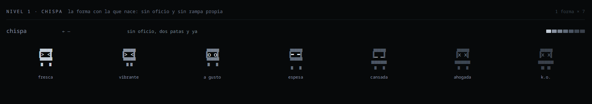
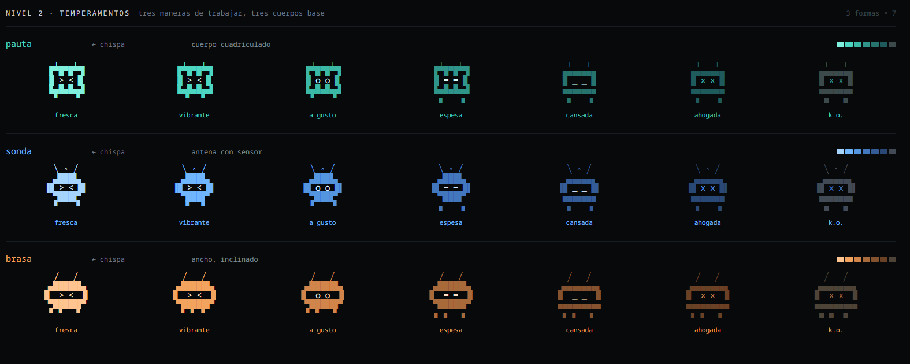
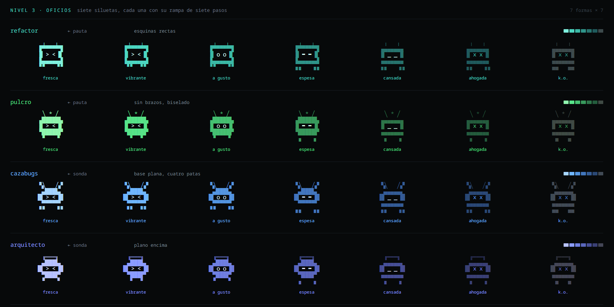
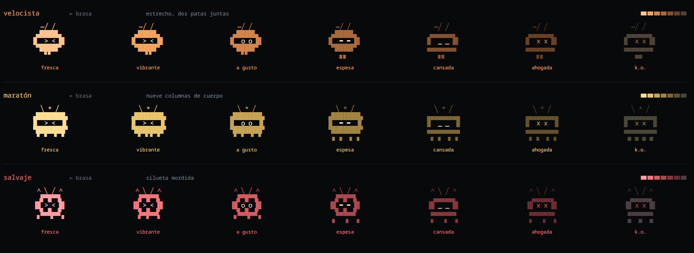

# claude-code-themes

Tres temas de color para [Claude Code](https://claude.com/claude-code) y una
**statusline** que ocupa el pie de la ventana: cuatro bandas de datos a la
izquierda y un bicho a la derecha que refleja el estado de la sesión y
**evoluciona según cómo trabajas** — 41 formas en un árbol de seis niveles, con
xp, hambre y racha.

Es un plugin instalable. El runtime es un binario de Go sin dependencias: ni
`python3`, ni `node`, ni `jq`.

```
──────────────────────────────────────────────────────────────────────────────────────────────────────────────
 Opus 5  ██████░░░░░░░░░░ 36% · 1M ctx │ xhigh │ 5h 41%  7d 13% │ 98% cache                           ▚╲   ╱▞
claude-code-themes (main) │ +184/−37 │ $28.29 │ 1h 12m                                                ▗▟███▙▖
criterio                                                                                             ▐█ > < █▌
cazabugs nivel 4 │ vibrante                                                                           ▖▖▀▀▀▗▗
```

*Salida real de `ccpet statusline`, sin el color. Las cuatro bandas y el bicho a
la derecha, en cuatro filas más la raya.*

| Tema | Acento | Look |
| --- | --- | --- |
| **Terminal** | `#4dd6c1` turquesa | un color por tipo de dato: rutas, identificadores, urls, números, modos |
| **Blood Red** | `#ff5c47` coral | cálido: coral, terracota, vino sobre fondo oscuro |
| **Electric Blue** | `#2e8bff` azul | frío: cian, azure, azul profundo sobre fondo oscuro |


*Los otros dos temas: **Electric Blue** a la izquierda (prompts, picker y selección
en azul) y **Blood Red** a la derecha (prompts coral). La statusline que asoma en
la esquina de esa captura es vieja; los colores del CLI, que es lo que la imagen
enseña, siguen siendo estos.*

Los tres cubren los **72 tokens** que reconoce Claude Code, no solo la docena que
se ve de un vistazo.

---

## Instalación

```
/plugin marketplace add gabriel-diagram/claude-code-themes
/plugin install claude-code-themes
/pet-statusline
```

Lo primero trae los temas, los comandos y los hooks que le dan de comer al bicho.
Lo tercero enciende la statusline. Después, `/theme` → Terminal.

**Por qué la statusline necesita ese tercer paso.** `statusLine` no es un
componente de plugin: la lista es `commands`, `agents`, `skills`, `hooks`,
`outputStyles`, `themes`, `mcpServers` y `lspServers` — comprobado contra el
binario de Claude Code. La clave hay que escribirla en `~/.claude/settings.json`,
y eso es lo que hace `/pet-statusline`, con copia de seguridad previa y escritura
atómica. `/pet-statusline off` la quita.

**Y por qué no apunta al plugin.** Un plugin vive en
`~/.claude/plugins/cache/<marketplace>/<plugin>/<versión>/`, **con la versión en
la ruta**. Los hooks no lo sufren porque el CLI vuelve a resolver
`${CLAUDE_PLUGIN_ROOT}` cada vez que los carga, pero `statusLine.command` es una
cadena que no resuelve nadie: apuntada al plugin se rompería en el primer update.
Así que apunta a `~/.claude/ccpet-statusline`, un enlace que un hook de
`SessionStart` mantiene al día. Cuesta un `readlink` por sesión.

### Sin plugin

```bash
scripts/install.sh            # temas + statusline + bicho + /pet y /feed
scripts/install.sh --hooks    # además engancha los hooks que le dan de comer
scripts/install.sh --uninstall
```

Copia el runtime a `~/.claude/ccpet` como directorio de verdad, y el hook del
plugin lo detecta y se aparta: dos instaladores peleándose por una ruta es peor
que uno de los dos cediendo. Hace copia de `settings.json` antes de tocarlo
—guarda las cinco más recientes—, es idempotente y **no cambia el tema activo**.

Los **hooks van aparte a propósito**: viven en `~/.claude/settings.json`, que es
global, así que corren en todos tus repos. Sin ellos el bicho existe y se ve,
pero no come solo — se le da con `/feed`.

### A mano

```bash
mkdir -p ~/.claude/themes ~/.claude/ccpet
cp themes/*.json ~/.claude/themes/
cp -R bin scripts ~/.claude/ccpet/
chmod +x ~/.claude/ccpet/bin/* ~/.claude/ccpet/scripts/*.sh
~/.claude/ccpet/bin/ccpet link       # crea los dos enlaces estables
```

Y en `~/.claude/settings.json`:

```json
{
  "theme": "custom:terminal",
  "statusLine": {
    "type": "command",
    "command": "~/.claude/ccpet-statusline",
    "hideVimModeIndicator": true,
    "refreshInterval": 1
  }
}
```

> El slug (`custom:<slug>`) sale del **nombre del archivo** sin `.json`, no del
> campo `"name"`: `blood-red.json` → `custom:blood-red`.

> `~/.claude/ccpet-statusline` es un enlace al binario de tu máquina, y el binario
> mira su propio `argv[0]` para saber qué hacer. Así la clave es una ruta pelada
> sin argumentos —la única forma que funciona tanto si el host la lanza con shell
> como si la ejecuta directamente— y no hay shell de por medio en algo que corre
> una vez por segundo.

---

## La statusline

Es un **pie**, no una línea más del hilo: fondo un tono por encima del negro y
una raya fina arriba. **Cinco filas en total** — la raya y cuatro bandas —, con
el bicho anclado a la derecha ocupando las cuatro.

```
──────────────────────────────────────────────────────────────────────────────────────────────────────────────
 Opus 5  ██████░░░░░░░░░░ 36% · 1M ctx │ xhigh │ 5h 41%  7d 13% │ 98% cache                           ▚╲   ╱▞
claude-code-themes (main) │ +184/−37 │ $28.29 │ 1h 12m                                                ▗▟███▙▖
criterio                                                                                             ▐█ > < █▌
cazabugs nivel 4 │ vibrante                                                                           ▖▖▀▀▀▗▗
```

Cada banda agrupa datos que se miran juntos, y suelta los elementos de menor
prioridad antes que hacer *wrap*, que descuadra la caja del prompt.

### Banda 1 · el motor

Modelo, contexto, **los dos límites**, razonamiento y ritmo: lo que cambia cada
turno.

Las cuotas van como número pelado, sin barra, y **pintadas con la misma escalera**
que la barra de contexto y el bicho: un `5h` al 95% sale en el índigo de *ahogada*,
así que lo que está a punto de pararte es el color más fuerte de la línea aunque
el bicho esté verde. Es la respuesta a «¿por qué está ahogado si la ventana está
vacía?».

El **`tok/s`** es real, no una estimación, y hay que mirar de dónde sale. Los dos
campos del payload **no miden lo mismo**: `total_output_tokens` es lo que sacó la
*última* respuesta (se reinicia cada turno, no es un contador que sube), mientras
`total_api_duration_ms` es el tiempo de API *acumulado* de la sesión. El ritmo de
la última respuesta es lo primero entre lo que ha crecido lo segundo. Restar dos
`total_output_tokens` seguidos no mide nada: son dos respuestas distintas, y el
resultado sale inflado o negativo según cuál fuera más larga. Se apaga solo a los
dos minutos sin moverse, y entonces el acierto de caché ocupa ese hueco. Nunca
salen los dos.

### Banda 2 · el trabajo

Repo, rama, diff, coste **y el reloj de la sesión**: lo que la sesión lleva
gastado, en dinero y en horas. Se leen juntos al final de una larga.

El nombre del repo lo da `workspace.repo.name` del payload cuando hay remoto, y
si no, la carpeta raíz. Solo el nombre: el owner es siempre el mismo y no te dice
dónde estás.

### Banda 3 · dónde y con qué criterio

La carpeta y el **estilo de salida activo**: lo que casi no se mueve.

De la ruta sale únicamente **la carpeta en la que estás**, y si se llama igual que
el repo —es decir, estás en su raíz— desaparece, porque eso ya lo dice la banda 2.

Los dos salen a pelo, sin etiqueta, y quien los distingue es el color: la carpeta
en gris porque es un sitio, el estilo en el morado de `Mode` porque es un ajuste
de la CLI. Se leen en orden *dónde → quién*, y cuando la banda se queda corta cae
antes el estilo.

El estilo sale **en minúscula**, y eso es la voz del pie, no un dato del estilo:
todo lo demás que ocupa ese sitio ya llega en minúscula —`xhigh`, `plan`,
`auto-edit`, el `cazabugs` del bicho—, así que un nombre capitalizado sería la
única palabra de la línea que grita. Se hace en la banda y no al leer el payload
por dos razones: `Payload.Style` conserva el nombre real, y así entran también
`Explanatory` y `Learning`, que vienen capitalizados y **no se pueden renombrar**.

**Y el nombre se comprueba contra el disco antes de pintarlo**, que es la parte
que importa. El payload manda el nombre **configurado**, no el cargado — en el CLI
son dos pasos y solo llega el primero:

```js
let d = Tn()?.outputStyle || "default"
return e[d] ?? null              // e = los estilos que cargaron
...
output_style: { name: Xe }       // Xe = la config, en crudo
```

O sea que una errata en `settings.json`, o un archivo borrado, se reportan igual
que un estilo que funciona **mientras el system prompt se queda vacío**. Pintar
ese nombre sería repetir la afirmación en vez de verificarla, así que la banda lo
busca ella: los estilos de fábrica resuelven sin archivo, y el resto tiene que
aparecer en `~/.claude/output-styles/` o en `.claude/output-styles/` del repo, con
la regla de nombre del propio CLI —el `name:` del frontmatter, y si no el nombre
del archivo sin `.md`, comparado con mayúsculas y todo, porque al otro lado es una
clave de objeto—. Si no aparece, no se pinta.

Lo que **no** detecta: un estilo que resuelve pero que no está cargado *en esta
sesión* porque la config cambió después de arrancarla. No hay rastro barato que
distinga eso. Se arregla reabriendo, y la banda no finge saberlo.

Sin estilo puesto el payload no manda un hueco: manda la palabra `"default"`
—`output_style: {name: outputStyle || "default"}`, leído del binario, no supuesto—
y pintarla gastaría columnas en decir que no hay nada.

La banda **puede quedar vacía**: en la raíz de un repo y sin estilo, que es la
mayoría de las sesiones. Esa fila se ancla con un **braille en blanco** (`U+2800`),
porque Claude Code recorta los espacios de la izquierda y sin él el trozo de bicho
de esa fila se cae al borde.

### Banda 4 · el bicho

Oficio, la marca entre corchetes, nivel, **cómo está**, la barra y el bocadillo.

```
cazabugs[sabueso] nivel 5 │ fresca ✦ │ ████░░░░ │ ◗ cinco días de racha
```

El corchete escribe **la marca que el bicho lleva puesta**, con el oficio del que
es variante fuera: se lee entero como un nombre, *un cazabugs, en su forma
sabueso*. El árbol se bifurca en los niveles 2, 3 y 5, y la marca es la del 5, así
que el corchete sale ahí y en ningún otro sitio: `cazabugs` en el nivel 4,
`cazabugs[sabueso]` en el 5, y `lobo` a secas en el 6, donde el título es el final
de la rama y no necesita contexto.

> **Decía lo contrario.** Escribía la marca a la que el bicho *apuntaba*, de modo
> que un nivel 4 leía `cazabugs[sabueso]` sin ser un sabueso. La idea era que el
> corchete fuese el tiempo verbal —un nombre dice *es*, un corchete dice *va
> hacia*—, y eso solo funciona si se ve: iba pintado en el color de la barra
> separadora, **1,54:1** contra el fondo frente al **11,8:1** de las dos palabras
> que lo rodean. Dos palabras brillantes pegadas sin nada visible en medio se leen
> como un nombre compuesto, que es exactamente lo que era.

La barra mide **el tramo de este nivel**, no la xp total, así que amanece vacía el
día después de subir. En el tope, donde ya no queda escalera, cambia de moneda:
pasa a medir el **hábito** que abre la siguiente marca, en ámbar y con su nombre
al lado. Un bicho que ya lleva la suya no tiene ninguna de las dos, y entonces la
banda se sostiene sobre el estado.

### Qué se cae al estrechar

| Columnas | Qué pasa |
| --- | --- |
| < 100 | la banda 4 se queda **solo con el oficio**: se van corchete, nivel, estado, barra y bocadillo |
| < 55 | el bicho desaparece entero y quedan las cuatro bandas solas |

---

## El bicho

Nueve columnas. La silueta **y el color** los elige la evolución; los ojos, las
patas y el peldaño de esa rampa los elige el estado. Cada rama tiene su tono y lo
mantiene en los siete estados: un cazabugs es azul tanto fresco como ahogado, que
es lo que permite distinguir 41 siluetas en las filas que hay.

Viene en dos tallas. **Cinco filas** en `/pet`, donde sobra sitio:

```
  |   |     <- marca de la ramificación (se cae al llegar a cansada)
 ▗▟┼█┼▙▖    <- cuerpo de la evolución
▐█ > < █▌   <- cara, con las orejas fuera
 ▝▜┼█┼▛▘
 ▘▘   ▝▝    <- patas
```

Y en la statusline, **una cresta más tres filas compactas**: se va el contorno de
abajo y las patas se meten dentro del cuerpo. Sigue andando (`▘▝…▝▘` ↔ `▝▘…▘▝`),
se hunde (`▖▗…▗▖`) y se tumba (`▄▄▀▀▀▄▄`).

Las formas se distinguen por el **cuerpo**, que es lo que la talla corta conserva:
`▗▟┼█┼▙▖` no es `▗▟███▙▖` ni `▟███████▙`.

### Siete estados

Un solo número entre 0 y 100 decide estado, ojos, patas y el peldaño de la rampa:

```
uso = context_window.used_percentage
```

Y cambia **cuatro señales independientes**, en este orden: primero los ojos, luego
el paso de las patas, luego la cabeza se hunde y al final la silueta se tumba. A un
vistazo se distingue *cansada* de *ahogada* sin leer la etiqueta.

| Uso | Etiqueta | Ojos | Cabeza | Patas |
| --- | --- | --- | --- | --- |
| ≤22% | fresca ✦ | `>` `<` | sí | anda |
| ≤45% | vibrante | `>` `<` | sí | anda |
| ≤63% | a gusto | `o` `o` | sí | anda |
| ≤78% | espesa | `▬` `▬` | sí | quieto |
| ≤89% | cansada | `_` `_` | **hundida** | quieto |
| <100% | ahogada | `x` `x` | hundida | quieto |
| 100% | k.o. | `x` `x` | hundida | **tumbado**, patas al aire |

Los ojos de las dos primeras filas son **los de la evolución**, que tiene los
suyos; de *a gusto* para abajo manda el estado, y así el cansancio se lee igual
sea cual sea el bicho.

**Solo el contexto, y es a la tercera.** Aquí hubo una media ponderada 50/30/20 de
contexto y las dos cuotas, y diluía justo el caso que importa: con la ventana llena
y las cuotas ociosas daba 58 —«a gusto»— con el contexto agotado. Se cambió por el
cuello más apretado, `max(ctx, 5h, 7d)`, que arregló eso y trajo otra cosa: **las
cuotas son de la cuenta**, así que todas las sesiones abiertas leían el mismo número
y el bicho dejaba de hablar de la sesión en la que vive — una ventana al 6% y otra
al 64% las dos `cansada` por un límite de 5h al 81%, y un `/clear` que no cambiaba
nada.

El contexto sí es una experiencia: una ventana llena es un Claude más lento y más
espeso, y eso lo notas mientras trabajas. Una cuota al 81% no se nota en ninguna
respuesta —se nota cuando te corta—, así que **no lleva cara, lleva número**. El
razonamiento entero está en [vitals.md](docs/design/vitals.md).

**Movimiento.** Las patas alternan en cada refresco: anda mientras trabajas y se
queda quieto a partir de *espesa*. El parpadeo (`_ _`) es un solo frame cada siete
refrescos. Al cruzar un umbral la etiqueta sale en negrita un refresco — para eso
guarda el estado anterior en `$TMPDIR/claude-statusline-<session_id>`.

A 1 fps, unas patas alternando sin parar en la esquina del ojo cansan, así que
**por defecto anda cuatro segundos de cada doce**. `STATUSLINE_PET_WALK=1` devuelve
el baile continuo.

### El árbol: 41 formas

La forma no la eliges: sale de cómo trabajas. Los commits y los `/compact` te
llevan por la rama **metódica**, los tests y los planes por la **inquisitiva**, y
trabajar con el contexto arriba por la **impulsiva** — el pico de la sesión, no el
reventón: pasar del 85% es haber tirado al límite, y del 95% es no haber frenado.
Reventarlo del todo solo cuesta xp.

```
        nivel 1        2            3          5              6
        chispa ─┬─ brasa ─┬─ maratón ──┬─ buey ────── mamut
                │         │            └─ topo ────── gusano
                │         ├─ salvaje ──┬─ gremlin ─── diablo
                │         │            └─ kraken ──── leviatán
                │         └─ velocista ┬─ francotirador ─ halcón
                │                      └─ relámpago ─ tormenta
                ├─ pauta ─┬─ pulcro ───┬─ jardinero ─ bosque
                │         │            └─ monje ───── abad
                │         └─ refactor ─┬─ cirujano ── bisturí
                │                      └─ tejedor ─── telar
                └─ sonda ─┬─ arquitecto┬─ cartógrafo ─ atlas
                          │            └─ oráculo ─── esfinge
                          └─ cazabugs ─┬─ exterminador ─ avispa
                                       └─ sabueso ──── lobo
```

1 raíz + 3 temperamentos + 7 oficios + 14 marcas + 14 títulos = **39**, más dos
secretas fuera del árbol: `fénix` y `quimera`. El nivel 4 no bifurca — es el
oficio otra vez, con más xp.

#### Cómo se lee una forma

Cada fila es una forma dibujada en los siete estados. **La marca de arriba y el
número de patas identifican la forma y no cambian nunca**; el estado rellena los
ojos, mueve el paso, aplana el cuerpo a partir de *cansada*, lo tumba en *k.o.*
sin perder la cuenta de patas, y baja el color por la rampa de esa rama — los
siete pasos que se ven arriba a la derecha de cada fila.



*Nivel 1 — `chispa`: sin oficio y sin rampa propia.*



*Nivel 2 — tres maneras de trabajar, tres cuerpos base: `pauta` (cuadriculado),
`sonda` (antena con sensor) y `brasa` (ancho, inclinado).*




*Nivel 3 — los siete oficios, cada uno con su rampa de siete pasos. De `pauta`
salen `refactor` y `pulcro`; de `sonda`, `cazabugs` y `arquitecto`; de `brasa`,
`velocista`, `maratón` y `salvaje`.*

Las marcas del nivel 5 y los títulos del nivel 6 heredan la rampa de su oficio:
un sabueso es azul igual que el cazabugs del que sale, y lo que los distingue es
el cuerpo. Por eso diez rampas bastan para 41 formas.

<details>
<summary><b>Las 41 siluetas</b> (la fila del cuerpo, que es la que distingue)</summary>

```
1  chispa           ▗▄▄▄▖      sin oficio, dos patas y ya

2  brasa           ▗▟█████▙▖   ancho, inclinado
3  maratón         ▟███████▙   nueve columnas de cuerpo
5  buey            ▟███████▙   cuernos anchos
6  mamut           ▟███████▙   ocho patas
5  topo             ▗▄▄▄▄▄▖    agachado, garras
6  gusano           ▗▄▄▄▄▄▖    cuerpo segmentado
3  salvaje          ▗▛▀█▀▜▖    silueta mordida
5  gremlin          ▗▛▀█▀▜▖    orejas dobles
6  diablo           ▗▛▀█▀▜▖    cuatro cuernos
5  kraken           ▗▟███▙▖    tentáculos, sin patas
6  leviatán         ▗▟███▙▖    nueve tentáculos
3  velocista       ▗▟████▙▖    estrecho, dos patas juntas
5  francotirador    ▗▟███▙▖    mira encima
6  halcón           ▗▟███▙▖    mira doble
5  relámpago       ▗▟████▙▖    estela detrás
6  tormenta        ▗▟████▙▖    tres estelas

2  pauta            ▛▀█▀█▀▜    cuerpo cuadriculado
3  pulcro           ▟█████▙    sin brazos, biselado
5  jardinero       ▗▟█████▙▖   ancho y con brotes
6  bosque          ▗▟█████▙▖   cuatro patas, brotes
5  monje            ▟█████▙    encapuchado
6  abad             ▟█████▙    base sellada
3  refactor         ▛▀▀▀▀▀▜    esquinas rectas
5  cirujano         ▛▀▀▀▀▀▜    corte recto, sin curvas
6  bisturí          ▛▀▀▀▀▀▜    filo, base sellada
5  tejedor          ▗▟███▙▖    cuerpo tramado
6  telar            ▗▟███▙▖    seis patas

2  sonda            ▗▟███▙▖    antena con sensor
3  arquitecto       ▗▟███▙▖    plano encima
5  cartógrafo       ▄▄▄▄▄▄▄    cuerpo en losa
6  atlas            ▄▄▄▄▄▄▄    plano completo
5  oráculo          ▗▄▟█▙▄▖    cúpula en punta
6  esfinge          ▗▄▟█▙▄▖    dos gemas, patas anchas
3  cazabugs         ▗▟███▙▖    base plana, cuatro patas
5  exterminador     ▗█▀▀▀█▖    pinzas, cuerpo hueco
6  avispa           ▗█▀▀▀█▖    seis pinzas
5  sabueso          ▗▟███▙▖    hocico bajo
6  lobo             ▗▟███▙▖    orejas caídas

S  fénix           [▗▟███▙▖]   alas a los lados
S  quimera          ▗▟█┼█▙▖    mezcla de dos cuerpos
```

Salen de `internal/pet/testdata/ATLAS.json`, que está en el repo y **cuatro tests
comparan contra el Go**: los 41 nombres, las 10 rampas de 7 colores, los padres del
árbol y las 287 siluetas fila a fila.

</details>

### Cómo come

| Evento | xp | Hambre | Freno |
| --- | --- | --- | --- |
| tests en verde | **+15** | −4 | una vez por hora, y solo si has cambiado algo |
| commit | **+12** | −3 | — |
| compact | **+8** | −3 | — |
| tarea del plan cerrada | **+6** | −1 | — |
| `/feed` | **+3** | −2 | uno cada cuatro horas |
| contexto al 100% | **−15** | — | rompe la racha |

| Nivel | xp |
| --- | --- |
| 1 → 2 | 60 |
| 2 → 3 | 180 |
| 3 → 4 | 400 |
| 4 → 5 | 2000 |
| 5 → 6 | 4500 |

**Y no se farmea.** La suite verde es la comida más grande y era la única sin
freno: correrla en bucle daba 120 xp en ocho minutos, medido. Ahora cuenta una vez
por hora y solo si has editado algo desde la última — una suite que pasa sin una
edición detrás no es trabajo, es la misma suite otra vez.

**Y baja.** El hambre sube **+1 por hora** sin comer, con tope en 10; a partir de
ahí deja de ser un aviso y cada hora cuesta **1 xp**.

La xp tiene techo: el último umbral más un tramo de nivel 1, o sea
`4500 + 60 = 4560`. Sin él, el colchón acumulado se traga cualquier castigo —a
1641 xp con el tope en 900 hacían falta **cincuenta** contextos reventados para
bajar un nivel—, así que toda penalización era decorativa.

De ahí salen las dos cifras que importan, y salen solas: el colchón por encima del
último umbral son 60 xp, y a 1 xp/hora eso son **60 horas — dos días y medio— para
perder el nivel de arriba**; y el techo entero son 4560 horas, **unos seis meses
sin tocarlo para volver a larva**.

Nunca muere: por abajo se queda en `chispa`, que es una forma, no una tumba.

**Una forma no baja de escalón.** Se mueve en lateral o hacia arriba, nunca abajo:
un `exterminador` puede pasar a `sabueso` (mismo peldaño, el otro hábito) o a
`avispa` (su título), pero **nunca** vuelve a `cazabugs`. Dos consecuencias que
parecen fallos y no lo son: cambiar de temperamento deja de mover la forma en
cuanto llevas una marca (se mueve en cuanto ganes una marca en la rama nueva), y
**el nivel sí puede bajar aunque la forma no**, así que `avispa nivel 5` es una
pareja legítima.

El árbol entero, la tabla de comida completa y qué alimenta cada contador están en
[evolution.md](docs/design/evolution.md).

### Lo que dice

El bocadillo de la banda 4 no es un chat: **por defecto calla**.

- **Primero el evento, luego la forma.** Habla cuando pasa algo —subida de nivel,
  contexto reventado, hambre ≥7, una comida grande, la racha en juego— y en ese
  orden. Las frases de evento las dice cualquier bicho; para una comida grande abre
  el **repertorio de su oficio**:

  > `cazabugs` ◗ el bug no era el código, era el jueves
  > `maratón` ◗ esto ya no es una sesión, es un piso compartido
  > `salvaje` ◗ he tocado prod. tranquilo. era el seed.

- **Sin repetir.** Las tres últimas frases viven en `pet.json` y no vuelven hasta
  agotar el repertorio.
- **Una cada cinco minutos**, como mucho.

Habla en castellano, y se llama en castellano: `cazabugs`, `francotirador`,
`vibrante`. Los nombres ingleses siguen ahí **como ids** — es lo que hay escrito en
el `pet.json` de todo el mundo desde la versión en Python, y renombrarlos
reescribiría todos los ficheros de vida que hay por ahí. La traducción vive en
`internal/pet/names.go`; una forma sin entrada cae en su propio id.

### El panel `/pet`

`/pet` enseña los **22 contadores que deciden el árbol**, no solo los cuatro que
se ven en la statusline:

```
  cazabugs   nivel 4
  inquisitivo › sonda › cazabugs

  nivel  █░░░░░░░░░░░░░░░  533/2000 xp
  hambre ██░░░░░░░░  2
  racha  ███░░░░  3 días · mejor 3

  1467 para sabueso │ comió hace 25m

  la marca del nivel 5
    ✓ sabueso        reproducir antes de arreglar  36/10
      exterminador   días seguidos en verde         2/15

  hábitos  · cumplido  ·  en camino  ·  no lleva a nada desde aquí
    reproducir antes de arreglar  36/10   inquisitivo                   22
    suites en verde               22      diffs limpios                 19
    metódico                      19      commit más ancho               7
    días seguidos con diff limpio  4      días seguidos en verde        2/15
```

El color significa **una sola cosa**: si ese contador te lleva a algún sitio al que
todavía puedes llegar. Verde, cumplido; ámbar, en camino; blanco, no abre nada
desde donde estás. La mayoría de la tabla es blanca, y ese es el dato — un contador
con 216 puede estar alimentando una rama por la que ya pasaste de largo.

Debajo van las sesiones, la tabla de comida con sus tiempos de espera y el registro
de hoy.

```bash
/pet     # el panel entero
/feed    # +3 xp, hambre −2 (uno cada cuatro horas)
```

---

## Las paletas

### Terminal — un color por tipo de dato

La regla es que un tipo de dato lleva siempre el mismo color, en la statusline y en
la prosa. Así no hay que leer para saber qué estás mirando.

| Rol | Hex | |
| --- | --- | --- |
| Rutas, ficheros, tablas, repos | `#4DD6C1` | turquesa |
| Identificadores, código inline, altas | `#57E389` | verde |
| Urls, ramas, enlaces | `#6FB6FF` | azul claro |
| Números, dinero, métricas, avisos | `#E8C46A` | ámbar |
| Modos y ajustes del propio CLI | `#B07CF0` | violeta |
| Bajas, errores, riesgo | `#F2777A` | salmón |
| Énfasis en prosa (negrita) | `#ECEFF4` | casi blanco |
| Flechas, separadores, unidades | `#6B7683` | gris |

### Blood Red y Electric Blue

| Rol | Token | Blood Red | Electric Blue |
| --- | --- | --- | --- |
| Acento de marca | `claude` | `#ff5c47` | `#2e8bff` |
| Texto | `text` | `#f0e4e0` | `#e7eef4` |
| Líneas / bordes | `subtle` | `#a5342c` | `#2f5aa0` |
| Borde del input | `promptBorder` | `#b83028` | `#1f4fcc` |
| Borde en modo `!bash` | `bashBorder` | `#c97b4a` | `#4a7bc9` |
| Fondo de selección | `selectionBg` | `#6b2028` | `#173a66` |
| Fondo de tus mensajes | `userMessageBackground` | `#2a1416` | `#0f1e38` |
| Error / Éxito / Aviso | `error`/`success`/`warning` | `#ff4b3e` / `#8fae7a` / `#e0a35c` | iguales |

**Los tres temas cubren los 72 tokens.** Los que no se ven de un vistazo —el
spinner, las pastillas de *skill* y *fast mode*, los fondos de los bloques de bash
y de memoria, los diffs apagados, los ocho colores de subagente y el arcoíris—
heredaban del preset `dark`, es decir de la paleta de Anthropic: naranja `#d77757`,
azules `#4782c8` y `#93a5ff`, amarillo `#fbbc04`. Se colaban por los bordes y
rompían el tema.

---

## Ajustes

| Variable | Efecto |
| --- | --- |
| `STATUSLINE_PET=0` | apaga el bicho, deja las cuatro bandas |
| `STATUSLINE_PET_WALK=1` | anda en cada refresco en vez de a ratos |
| `STATUSLINE_BACKGROUND=0` | quita el fondo del pie, deja las líneas transparentes |
| `STATUSLINE_RULE=0` | quita la raya de arriba y ahorra una fila |
| `STATUSLINE_RIGHT_PAD` | margen derecho, por defecto `6` |
| `PET_TEST_RUNNERS` | regex extra para reconocer tu runner de tests |
| `CLAUDE_CONFIG_DIR` | mueve `~/.claude`; el bicho y la statusline lo respetan |

### Truecolor en Docker / SSH

Los temas usan color de 24 bits. Sin `COLORTERM` la interfaz cuantiza cada hex al
color más cercano de una paleta reducida y los tonos parecidos colapsan al mismo.
**Windows Terminal y WSL no exportan `COLORTERM`**:

```bash
export COLORTERM=truecolor                                  # .zshrc / .bashrc
docker run -e COLORTERM=truecolor -e TERM=xterm-256color ...
```

El bicho sí tiene plan B: cuantiza cada color al cubo de 256 de verdad, así que en
un terminal sin truecolor se ve, aunque con menos tonos.

### El margen derecho

La statusline **no recibe el ancho de la terminal** —no hay campo para eso en el
JSON—, así que sale de `COLUMNS`. Y Claude Code recorta la línea unas 5 columnas
antes, de modo que alinear sobre `COLUMNS-1` trunca el bicho o lo hace *wrap*. De
ahí el margen de 6 por defecto: si queda despegado del borde, bájalo; si se corta,
súbelo.

### Lo que no puede hacer

- La línea de `bypass permissions` y los badges tipo `/rc active` los pinta Claude
  Code en su propio footer. El script imprime texto; dónde coloca él sus badges no
  está en su mano. Por eso el modo de permisos sale como **marca** y no como
  palabra: en bypass, un `⚡` rojo, en vez de deletrear otra vez lo que ya está
  escrito tres líneas más arriba.
- **El techo de la animación son 1 fps.** La statusline se re-ejecuta por eventos
  (con *debounce* de 300 ms) y en reposo solo si defines `refreshInterval`, cuyo
  mínimo es 1 segundo.
- El **banner de bienvenida** usa acentos de onboarding que no forman parte del
  sistema de temas: se queda en el rosa de marca con cualquier tema activo.

---

## Bajo el capó

### Por qué Go

Estaba en Python y funcionaba. El problema no era el código —medido, hacía su
trabajo en 1,5 ms— sino lo que cuesta que Python se presente: 5,4 ms de intérprete
más 12,9 de imports, de los cuales 10 eran `subprocess` y `re` con todo lo que
arrastran. Ese peaje se pagaba **una vez por segundo** en la statusline y **en cada
llamada a herramienta** en el hook.

| | Python | Go |
| --- | --- | --- |
| statusline (1 vez/segundo) | 22,4 ms | **1,5 ms** |
| hook, camino lento (`Bash`, `Edit`, `TodoWrite`) | 21,3 ms | **1,7 ms** |
| hook, camino rápido (todo lo demás) | 2,6 ms | **1,5 ms** |
| panel `/pet` | 14,7 ms | **1,4 ms** |

El hook es el que importa: colgaba 21 ms de cada `Bash` y cada `Edit`.

> Esa tabla es la medición de la migración, con las dos columnas tomadas igual.
> Reproducirla hoy solo se puede a medias —la mitad Python ya no existe— y el
> orden de magnitud es lo que aguanta, no el decimal: 200 invocaciones seguidas
> de `ccpet statusline` en esta máquina (WSL2) dan **1,7–1,9 ms de reloj**, de los
> cuales unos **0,45 ms son el coste de arrancar un proceso cualquiera** — un
> `/bin/true` medido en el mismo bucle. WSL2 mide con ruido: una ronda de las
> nueve devolvió un delta negativo. Si necesitas el número exacto, mídelo en tu
> máquina:
>
> ```bash
> for i in $(seq 200); do COLUMNS=116 ./bin/ccpet-linux-amd64 statusline < payload.json >/dev/null; done
> ```

### La mitad de la statusline era `git`

La statusline marcaba 3,5 ms en la primera medición y ahora 1,5, y la diferencia no
es que Go corriera más:

| | |
| --- | --- |
| leer la rama de `.git/HEAD` | **0,9 µs** |
| `git status` para saber si el árbol está sucio (un fork) | **1,1 ms** |
| ese mismo dato, ya en caché | **4,2 µs** |
| el resto del refresco: parsear, medir, componer las cuatro bandas | **3,4 µs** |

Con `refreshInterval: 1` eso era un fork de `git` por segundo y por sesión abierta
para redibujar algo que casi nunca ha cambiado. Así que las dos mitades se separan:
**la rama sale de leer `.git/HEAD`** —sin fork, siempre exacta, y de paso acierta
en detached, en worktree y en un repo sin ningún commit— y solo el asterisco de
«árbol sucio» pasa por `git`, **con tres segundos de caché**. Eso es lo único del
pie que puede ir con retraso: haces un commit y el ✳ tarda hasta un refresco largo
en apagarse. A cambio, dos de cada tres refrescos no forkean nada.

### Un `pet.json`, muchas ventanas

`~/.claude/pet.json` es **uno solo** para todas tus sesiones y todos tus repos, y el
hook lo toca en **cada llamada a herramienta**. Como Claude Code lanza herramientas
en paralelo, dos escrituras a la vez no son el caso raro: son el caso normal.

Se escribía con `rename`, que es atómico, y eso resuelve un problema distinto del
que había: garantiza que nadie lea un json a medias, y no impide que dos escritores
se pisen. Como cada escritura vuelca el estado **entero**, el que llega tarde
devuelve al fichero todo lo que leyó y deshace al otro. Medido antes de arreglarlo:
**100 comidas en paralelo dejaban 72 puntos de xp de 800**.

Ahora toda modificación pasa por un candado (`pet.json.lock`, al lado, vacío): se
lee y se escribe dentro de él, así que las 100 comidas dejan los 800 puntos. Es un
`flock` del kernel —`LockFileEx` en Windows—, no un fichero centinela, de modo que
un proceso que muera a media escritura lo suelta él solo y no deja nada atascado.
Si el candado no se consigue en dos segundos se escribe igualmente sin él: perder
un punto de xp de vez en cuando es un arañazo, y un hook colgado bloquea la
herramienta que tiene detrás.

El mismo candado protege el registro de herramientas de la sesión, que se vaciaba
en dos pasos y perdía lo que llegara entre uno y otro — **17.508 nombres de 24.000
bajo carga**.

### Los binarios están en el repo, y el CI los comprueba

El plugin se instala clonando este repo, así que las cinco compilaciones viven en
`bin/`. Eso solo funciona si están al día, y por eso el CI recompila y compara.

Para que esa comparación signifique algo la compilación tiene que ser
**reproducible**: `scripts/build.sh` pasa `-trimpath -buildvcs=false`. Sin lo
segundo, Go sella en cada binario el commit y una marca `vcs.modified` con el
estado del árbol — y como `bin/` está versionado, escribir la primera compilación
ensucia el árbol que lee la segunda. Dos compilaciones del mismo código nunca daban
el mismo binario, y el trabajo del CI habría fallado siempre diciendo «bin/ is
stale» con `bin/` al día.

`.github/workflows/ci.yml` corre gofmt, `vet`, `go test -race` en ubuntu y macos,
la sintaxis de los scripts y la validez de los json.

---

## Migración desde la versión anterior

El proyecto pasó de Python a Go, y el código, las claves de `~/.claude/pet.json` y
los ids de las 41 formas pasaron a inglés. **No hay que hacer nada**:
`scripts/install.sh` borra los lanzadores sueltos que la versión vieja dejaba en
`~/.claude/` (`statusline.sh`, `bicho.py`, `pet`, `pet-hook.sh`), y el `pet.json` se
traduce solo la primera vez que se escribe — `hambre` pasó a `hunger`, `chispa` a
`spark`. Lo que lees en pantalla volvió al castellano; el fichero sigue guardando
los ids. El bicho conserva xp, racha, contadores y forma secreta.

Lo único que hay que cambiar a mano son las variables de entorno, si las tenías
puestas. El código **no lee las viejas**, así que una que se quede sin renombrar no
da error: deja de tener efecto.

| Antes | Ahora |
| --- | --- |
| `STATUSLINE_BICHO` | `STATUSLINE_PET` |
| `STATUSLINE_BICHO_ANDA` | `STATUSLINE_PET_WALK` |
| `STATUSLINE_FONDO` | `STATUSLINE_BACKGROUND` |
| `STATUSLINE_REGLA` | `STATUSLINE_RULE` |

`STATUSLINE_RIGHT_PAD` y `PET_TEST_RUNNERS` no cambiaron de nombre.

---

## El repo

```
.claude-plugin/       el manifiesto y el marketplace
.github/workflows/    el CI: gofmt, vet, test -race, y bin/ contra el fuente
commands/             /pet, /feed, /pet-statusline
hooks/hooks.json      SessionStart, PostToolUse, PreCompact, SessionEnd
themes/*.json         los tres temas, 72 tokens cada uno
bin/ccpet-<os>-<arch> las cinco compilaciones; bin/ccpet elige
cmd/ccpet/            statusline, hook, panel, setup, link
internal/             paleta, sprites, estados, árbol, fichero de vida, bandas
scripts/build.sh      compila las cinco plataformas
scripts/install.sh    instalación sin plugin; --hooks engancha los hooks
```

- [`vitals.md`](docs/design/vitals.md) — la capa del momento: qué hace que pase de fresca a k.o.
- [`evolution.md`](docs/design/evolution.md) — la capa permanente: xp, comida y las 41 formas
- [`audit-log.md`](docs/audit-log.md) — histórico: la auditoría de la implementación en Python

## Licencia

[MIT](LICENSE).
