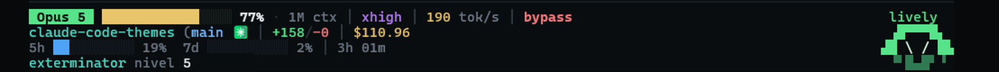

# claude-code-themes

Tres temas de color para la CLI de [Claude Code](https://claude.com/claude-code)
más una **statusline** de cuatro bandas con un bicho a la derecha que refleja el
estado real de la sesión — y que **evoluciona** según cómo trabajas: 27 formas
en un árbol de cinco niveles, con XP, hambre y racha.

| Tema | Acento | Look |
| --- | --- | --- |
| **Terminal** | `#4dd6c1` turquesa | un color por tipo de dato: rutas, identificadores, urls, números, modos |
| **Blood Red** | `#ff5c47` coral | cálido: coral, terracota, vino sobre fondo oscuro |
| **Electric Blue** | `#2e8bff` azul | frío: cian, azure, azul profundo sobre fondo oscuro |



*Las cuatro bandas del tema **Terminal**, en una sesión de verdad. A la derecha
el bicho: `exterminador`, nivel 5, y encima su estado. Cuatro filas de terminal,
contando la raya. **La captura es anterior al cambio de nombres**: hoy la banda
4 lleva además el estado y todo sale en castellano.*


*Los otros dos temas: **Electric Blue** a la izquierda (prompts, picker y
selección en azul) y **Blood Red** a la derecha (prompts coral). La statusline
de esa captura es la vieja, de tres bandas.*

## Contenido

- `.claude-plugin/` — el manifiesto y el marketplace: esto es un plugin instalable
- `commands/` — `/pet`, `/feed` y `/pet-statusline`
- `hooks/hooks.json` — los hooks del plugin, con `${CLAUDE_PLUGIN_ROOT}`
- `themes/terminal.json` — tema por tipo de dato, el que empareja con la statusline
- `themes/blood-red.json` — tema cálido instalable vía `/theme`
- `themes/electric-blue.json` — tema frío instalable vía `/theme`
- `bin/ccpet-<os>-<arch>` — el binario, uno por plataforma; `bin/ccpet` elige
- `cmd/ccpet/` — el punto de entrada: `statusline`, `hook`, el panel, `setup`, `link`
- `internal/` — el paquete: paleta, sprites, estados, árbol, fichero de vida, bandas
- `scripts/build.sh` — compila las cinco plataformas
- `scripts/install.sh` — instalación sin plugin; con `--hooks`, también los hooks
- [`vitals.md`](docs/design/vitals.md) — la capa del momento: qué hace que pase de fresh a k.o.
- [`evolution.md`](docs/design/evolution.md) — la capa permanente: XP, comida y las 27 formas
- [`audit-log.md`](docs/audit-log.md) — rendimiento y errores, medido

## Instalación

Es un **plugin**. Tres líneas y ya:

```
/plugin marketplace add gabriel-diagram/claude-code-themes
/plugin install claude-code-themes
/pet-statusline
```

Lo primero trae los temas, los comandos `/pet` y `/feed`, y los hooks que le dan
de comer al bicho. Lo tercero enciende la statusline. Después, `/theme` → Terminal.

**Por qué la statusline necesita ese tercer paso.** `statusLine` no es un
componente de plugin: comprobado contra el binario de Claude Code, la lista es
`commands`, `agents`, `skills`, `hooks`, `outputStyles`, `themes`, `mcpServers`
y `lspServers`. La clave tiene que escribirse en `~/.claude/settings.json`, y eso
es lo que hace `/pet-statusline` — con copia de seguridad previa y escritura
atómica. `/pet-statusline off` la quita.

**Y por qué no apunta al plugin directamente.** Un plugin se instala en
`~/.claude/plugins/cache/<marketplace>/<plugin>/<versión>/`, con **la versión en
la ruta**. Los hooks y los MCP no lo sufren porque el CLI vuelve a resolver
`${CLAUDE_PLUGIN_ROOT}` cada vez que los carga, pero `statusLine.command` es una
cadena que no resuelve nadie: apuntada al plugin, se rompería en el primer
update. Así que apunta a `~/.claude/ccpet`, que es un enlace que un hook de
`SessionStart` mantiene al día. Cuesta un `readlink` por sesión.

### Sin plugin

```bash
scripts/install.sh            # temas + statusline + bicho + /pet y /feed
scripts/install.sh --hooks    # además engancha los hooks que le dan de comer
scripts/install.sh --uninstall
```

Copia el runtime a `~/.claude/ccpet` como directorio de verdad, y el hook del
plugin lo detecta y se aparta: dos instaladores peleándose por una ruta es peor
que uno de los dos cediendo. Hace copia de seguridad de `settings.json` antes de
tocarlo, es idempotente, y **no cambia el tema activo**.

Los **hooks van aparte a propósito**. Viven en `~/.claude/settings.json`, que es
global, así que corren en todos tus repos. Sin ellos el bicho existe y se ve,
pero no come solo: se le da con `/feed`.

### A mano, si prefieres

```bash
mkdir -p ~/.claude/themes ~/.claude/ccpet
cp themes/*.json ~/.claude/themes/
cp -R bin scripts ~/.claude/ccpet/
chmod +x ~/.claude/ccpet/bin/* ~/.claude/ccpet/scripts/*.sh
~/.claude/ccpet/bin/ccpet link       # crea los dos enlaces estables
```

Y en `~/.claude/settings.json`:

```json
{
  "theme": "custom:terminal",
  "statusLine": {
    "type": "command",
    "command": "~/.claude/ccpet-statusline",
    "hideVimModeIndicator": true,
    "refreshInterval": 1
  }
}
```

> `~/.claude/ccpet-statusline` es un enlace al binario de tu máquina, y el
> binario mira su propio `argv[0]` para saber qué hacer. Así la clave es una
> ruta pelada sin argumentos —la única forma que funciona tanto si el host la
> lanza con shell como si la ejecuta directamente— y no hay shell de por medio
> en algo que corre una vez por segundo.

> El slug (`custom:<slug>`) sale del **nombre del archivo** sin `.json`, no del
> campo `"name"`. `blood-red.json` → `custom:blood-red`. Instalado como plugin el
> tema lo carga el propio plugin y el slug lleva su prefijo.

**No necesita nada.** Es un binario estático de Go (`CGO_ENABLED=0`): ni
`python3`, ni `node`, ni `jq`. `git` es opcional; si no está, degrada con
elegancia.

### Por qué Go

Estaba en Python y funcionaba. El problema no era el código —medido, hacía su
trabajo en 1,5 ms— sino lo que cuesta que Python se presente: 5,4 ms de
intérprete más 12,9 de imports, de los cuales 10 eran `subprocess` y `re` con
todo lo que arrastran. Ese peaje se pagaba **una vez por segundo** en la
statusline y **en cada llamada a herramienta** en el hook.

| | Python | Go |
| --- | --- | --- |
| statusline (1 vez/segundo) | 22,4 ms | **3,5 ms** |
| hook, camino lento (`Bash`, `Edit`, `TodoWrite`) | 21,3 ms | **1,6 ms** |
| hook, camino rápido (todo lo demás) | 2,6 ms | **1,6 ms** |
| panel `/pet` | 14,7 ms | **2,1 ms** |

El hook es el que importa: colgaba 21 ms de cada `Bash` y cada `Edit`.

También desaparecieron dos cosas que solo existían para abaratar Python: el
prefiltro de bash del hook (arrancar el intérprete costaba 15 ms, así que había
que evitarlo) y la purga manual de `sys.path` (un `python3 -c` mete el
directorio actual en la ruta de imports, y un `json.py` cualquiera del repo que
tuvieras abierto secuestraba la statusline — comprobado, pasaba de verdad).

Queda un `bin/ccpet` de veinte líneas de bash que elige binario por plataforma,
porque `hooks.json` necesita una ruta fija. Usa `$OSTYPE` y `$MACHTYPE`, que
bash rellena solo: `uname` serían dos forks en algo que corre en cada llamada.
Y ni siquiera está en el camino caliente: `ccpet link` deja dos enlaces
estables —`~/.claude/ccpet-run` y `~/.claude/ccpet-statusline`— al binario de
tu máquina, y tanto el hook como la statusline van directos. El shim es el
plan B, y de paso repara los enlaces cuando un update del plugin los deja
colgando.

## La statusline en detalle

Es un **pie**, no una banda más: fondo un tono por encima del negro y una raya
fina arriba, para que se lea como parte de la ventana y no como una línea más
del hilo. Cuatro bandas a la izquierda y el bicho anclado a la derecha, en tres
filas. Cada banda agrupa datos que se miran juntos, y suelta los elementos de
menor prioridad antes que hacer *wrap* (que descuadra la caja del prompt):

```
──────────────────────────────────────────────────────────────────────────────────────────────────────────
 Opus 5  ██████░░░░░░░░░░ 36% · 1M ctx │ xhigh                                                   vibrante 
rochas-energy-backend │ +184/−37 │ $28.29                                                         ▗▟┼█┼▙▖ 
api │ 5h ████░░░░░░ 41%  7d █░░░░░░░░░ 13% │ 1h 12m                                              ▐█ > < █▌
refactor nivel 4 █████░░░░░░░ vibrante │ ◗ cinco días de racha. mañana no me falles.              ▘▝▜█▛▝▘ 
```

- **Banda 1 · motor** — modelo, contexto, razonamiento y ritmo: lo que cambia
  cada turno.
- **Banda 2 · trabajo** — repo, rama, diff y coste: lo que se lleva a un commit.
  El nombre del repo lo da `workspace.repo.name` del payload cuando hay remoto,
  y si no, la carpeta raíz del repo. Solo el nombre: el owner es siempre el mismo
  y no te dice dónde estás.
#### Ritmo y permisos

El **`tok/s`** es real, no una estimación, pero hay que mirar bien de dónde sale.
Los dos campos del payload **no miden lo mismo**: `total_output_tokens` es lo que
sacó la *última* respuesta (se reinicia en cada turno, no es un contador que
sube), mientras que `total_api_duration_ms` es el tiempo de API *acumulado* de la
sesión. El ritmo de la última respuesta es lo primero entre lo que ha crecido lo
segundo. Restar dos `total_output_tokens` seguidos no mide nada: son dos
respuestas distintas, y el resultado sale inflado o negativo según cuál fuera más
larga. Se apaga solo a los dos minutos sin moverse — cuando el modelo ya no está
hablando — y entonces el acierto de caché ocupa ese hueco. Nunca salen los dos.

El **modo de permisos** (`bypass`, `auto-edit`, `plan`) no viene en el payload,
pero sí en el transcript, cuya ruta sí llega. Se lee solo la cola del fichero
(0,02 ms) y sale como distintivo en la banda. No es una copia del pie que pinta
el propio Claude Code: aquello es suyo y no se puede tocar.

- **Banda 3 · cuota** — carpeta, límites 5h/7d y tiempo: se lee de reojo, va en
  gris. De la ruta sale **solo la carpeta en la que estás**, no el camino entero;
  y si se llama igual que el repo —- es decir, estás en su raíz—- desaparece,
  porque eso ya lo dice la banda 2.
- **Banda 4 · el bicho** — quién es, cuánto lleva, cómo está y lo que tenga que
  decir: **oficio, nivel, barra, estado y bocadillo**. El estado sale aquí
  además de coronar la tarjeta, que es lo que dibuja el lienzo y no la
  duplicación que parece: la tarjeta es lo primero que se cae al estrechar la
  terminal, y esta copia es la que aguanta.

  La barra mide **el tramo de este nivel**, no la xp total, así que amanece
  vacía el día después de subir. En el tope, donde ya no queda escalera, cambia
  de moneda: pasa a medir el **hábito** que abre la siguiente marca, en ámbar y
  con su nombre al lado. Un bicho que ya lleva la suya no tiene ninguna de las
  dos, y entonces la banda se sostiene sobre el estado.

  Por debajo de **100 columnas** se cae entera y queda solo el oficio.

Cuatro bandas contra cuatro filas de tarjeta —la etiqueta de estado y las tres
del bicho—, más la raya: **cinco filas en total**. Antes eran siete: el bicho
ocupaba cinco filas propias y el bocadillo una más. Por debajo de 55 columnas el
bicho desaparece y quedan las tres bandas de datos solas.

### El bicho

Nueve columnas. La silueta la elige la **evolución**; los ojos, las patas y el
color los elige el **estado**. Y viene en dos tallas: **cinco filas** en `/pet` y
en la galería de evoluciones, donde sobra sitio, y **tres** en la statusline,
donde dos filas de terminal valen más que una cresta.

```
  |   |     <- marca de la ramificación (se cae al llegar a tired)
 ▗▟┼█┼▙▖    <- cuerpo de la evolución
▐█ > < █▌   <- cara, con las orejas fuera
 ▝▜┼█┼▛▘
 ▘▘   ▝▝    <- patas

 ▗▟┼█┼▙▖    la de tres filas: se va la cresta, y el contorno de abajo
▐█ > < █▌   se estrecha para meter las patas dentro. Sigue andando
 ▘▝▜█▛▝▘    (`▘▝…▝▘` ↔ `▝▘…▘▝`), se hunde (`▖▗…▗▖`) y se tumba (`▄▄▀▀▀▄▄`).
```

Las formas se distinguen por el **cuerpo**, que es lo que la talla corta
conserva: `▗▟┼█┼▙▖` no es `▗▟███▙▖` ni `▟███████▙`.

Siete estados, y **cuatro señales independientes** que cambian en este orden: los
ojos, luego el paso de las patas, luego la cabeza se hunde y al final la silueta
se tumba. A un vistazo se distingue *tired* de *drowning* sin leer la etiqueta.

| Uso | Etiqueta | Ojos | Cabeza | Patas |
| --- | --- | --- | --- | --- |
| ≤22% | fresh ✦ | `>` `<` | sí | anda |
| ≤45% | lively | `>` `<` | sí | anda |
| ≤63% | easy | `o` `o` | sí | anda |
| ≤78% | sluggish | `▬` `▬` | sí | quieto |
| ≤89% | tired | `_` `_` | **hundida** | quieto |
| <100% | drowning | `x` `x` | hundida | quieto |
| 100% | k.o. | `x` `x` | hundida | **tumbado**, patas al aire |

Los ojos de las dos primeras filas son **los de la evolución**, que tiene los
suyos; de *easy* para abajo manda el estado. Así el cansancio se lee igual sea
cual sea el bicho.

**Movimiento.** Las patas alternan `▘ ▝` ↔ `▝ ▘` en cada refresco de la
statusline: anda mientras trabajas y se queda quieto a partir de *sluggish*. El
parpadeo (`_ _`) es un solo frame cada siete refrescos. Al cruzar un umbral la
etiqueta sale en negrita un refresco — para eso guarda el estado anterior en
`$TMPDIR/claude-statusline-<session_id>`.

### Lo que dice

El bocadillo de la banda 4 no es un chat: **por defecto calla**.

- **Primero el evento, luego la forma.** Habla cuando pasa algo —subida de
  nivel, contexto reventado, hambre ≥7, una comida grande, la racha en juego— y
  en ese orden. Las cuatro frases de evento las dice cualquier bicho; para una
  comida grande abre el **repertorio de su oficio**, y cada uno tiene el suyo:

  > `cazabugs` ◗ el bug no era el código, era el jueves
  > `maratón` ◗ esto ya no es una sesión, es un piso compartido
  > `salvaje` ◗ he tocado prod. tranquilo. era el seed.

  Los tres temperamentos, las catorce marcas y las dos secretas no tienen
  repertorio propio: solo dicen las compartidas.
- **Sin repetir.** Las tres últimas frases viven en `pet.json` y no vuelven
  hasta agotar el repertorio.
- **Una cada cinco minutos**, como mucho.

Habla en castellano, y desde el rediseño se llama en castellano también:
`cazabugs`, `francotirador`, `vibrante`. Los nombres ingleses siguen ahí, pero
como **ids** — es lo que hay escrito en el `pet.json` de todo el mundo desde la
versión en Python, y renombrarlos reescribiría todos los ficheros de vida que
hay por ahí. La traducción vive en `internal/pet/names.go`; una forma sin
entrada cae en su propio id.

A 1 fps, unas patas alternando sin parar en la esquina del ojo cansan, así que
**por defecto anda cuatro segundos de cada doce**. `STATUSLINE_PET_WALK=1`
devuelve el baile continuo del diseño.

### Evoluciones

La forma no la eliges: sale de cómo trabajas. Los commits y los `/compact` te
llevan por la rama metódica, los tests y los planes por la inquisitiva, y
reventar el contexto por la impulsiva.

```
chispa -> pauta / sonda / brasa -> siete oficios -> catorce marcas
```

```bash
/pet     # nivel, evolución, xp, hambre, racha y la comida de hoy
/feed    # +3 xp, hambre −2 (uno cada cuatro horas)
```

El árbol entero, la tabla de comida y qué alimenta cada contador están en
[evolution.md](docs/design/evolution.md). Sin `scripts/install.sh --hooks` el bicho existe y
se ve, pero solo come con `/feed`.

### El uso: media ponderada

Un solo número entre 0 y 100 decide estado, ojos, patas y color:

```
uso = 0.5 · ctx  +  0.3 · límite 5h  +  0.2 · límite 7d
```

**Por qué ponderada y no el peor de los tres.** El contexto es lo único que
puedes gestionar en el momento —compactar, cerrar la sesión, abrir otra—; los
límites solo avisan. Que el de 7 días vaya por el 80% no debería poner al bicho
al borde de la muerte si acabas de abrir la sesión.

Si falta alguno de los tres (las cuentas por API no reciben `rate_limits`), su
peso se reparte entre los que sí llegan. Y **el k.o. es el único caso exacto**:
hace falta el 100% clavado.

### Ajustes por entorno

| Variable | Efecto |
| --- | --- |
| `STATUSLINE_PET=0` | apaga el bicho, deja las tres bandas |
| `STATUSLINE_PET_WALK=1` | anda en cada refresco en vez de a ratos |
| `STATUSLINE_BACKGROUND=0` | quita el fondo del pie, deja las líneas transparentes |
| `STATUSLINE_RULE=0` | quita la raya de arriba y ahorra una fila |
| `STATUSLINE_RIGHT_PAD` | margen derecho, por defecto `6` (ver abajo) |
| `PET_TEST_RUNNERS` | regex extra para reconocer tu runner de tests |

**Sobre los espacios de la izquierda.** Claude Code **recorta los espacios del
principio** de cada línea de la statusline. Las filas cuya mitad izquierda va
vacía son solo "espacios + bicho": al recortarlos, el bicho se cae al borde
izquierdo y acabas con trozos sueltos por la pantalla. Esas filas se anclan con
un braille en blanco (`U+2800`), que se pinta vacío pero no es un espacio.

**Sobre el margen derecho.** La statusline **no recibe el ancho de la terminal**:
no hay campo para eso en el JSON, así que sale de `COLUMNS`. Y Claude Code
recorta la línea unas 5 columnas antes de `COLUMNS`, de modo que alinear a la
derecha sobre `COLUMNS-1` trunca el bicho o lo hace *wrap*. De ahí el margen de 6
por defecto: si queda demasiado despegado del borde, bájalo; si se corta, súbelo.

**Lo que no puede hacer.** La línea de `bypass permissions` y los badges tipo
`/rc active` los pinta Claude Code en su footer, no la statusline. El script
imprime texto; dónde coloca él sus badges no está en su mano.

**El techo de la animación son 1 fps.** La statusline se re-ejecuta por eventos
(con *debounce* de 300 ms) y en reposo solo si defines `refreshInterval`, cuyo
mínimo es `1` segundo. Sin `refreshInterval` el bicho sigue funcionando, pero
solo cambia de frame cuando algo lo re-dibuja.

## Gotcha: truecolor en Docker / SSH

Los **temas** y la statusline usan color de 24 bits (`#rrggbb`). Sin `COLORTERM`
la interfaz cuantiza cada hex al color más cercano de una paleta reducida y los
tonos parecidos colapsan al mismo. **Windows Terminal y WSL no exportan
`COLORTERM`**, así que ponlo en tu `.zshrc`/`.bashrc`:

```bash
export COLORTERM=truecolor
```

`docker run` tampoco lo propaga:

```bash
docker run -e COLORTERM=truecolor -e TERM=xterm-256color ...
```


## Paletas

### Terminal — un color por tipo de dato

La regla es que un tipo de dato siempre lleva el mismo color, en la statusline y
en la prosa. Así no hay que leer para saber qué estás mirando.

| Rol | Hex | |
| --- | --- | --- |
| Rutas, ficheros, tablas, repos | `#4DD6C1` | turquesa |
| Identificadores, código inline, altas | `#57E389` | verde |
| Urls, ramas, enlaces | `#6FB6FF` | azul claro |
| Números, dinero, métricas, avisos | `#E8C46A` | ámbar |
| Modos y ajustes del propio CLI | `#B07CF0` | violeta |
| Bajas, errores, riesgo | `#F2777A` | salmón |
| Énfasis en prosa (negrita) | `#ECEFF4` | casi blanco |
| Flechas, separadores, unidades | `#6B7683` | gris |

Las barras de límite van en `#4EA3F5` sobre `#1D2B38`, y el fondo de los mensajes
en `#0A0D0F`.

### Blood Red (cálido)

| Rol | Token | Hex |
| --- | --- | --- |
| Acento de marca | `claude` | `#ff5c47` |
| Texto | `text` | `#f0e4e0` |
| Líneas / bordes | `subtle` | `#a5342c` |
| Borde del input | `promptBorder` | `#b83028` |
| Borde en modo `!bash` | `bashBorder` | `#c97b4a` |
| Fondo de selección | `selectionBg` | `#6b2028` |
| Fondo de tus mensajes | `userMessageBackground` | `#2a1416` |
| Error / Éxito / Aviso | `error`/`success`/`warning` | `#ff4b3e` / `#8fae7a` / `#e0a35c` |

### Electric Blue (frío)

| Rol | Token | Hex |
| --- | --- | --- |
| Acento de marca | `claude` | `#2e8bff` |
| Texto | `text` | `#e7eef4` |
| Líneas / bordes | `subtle` | `#2f5aa0` |
| Borde del input | `promptBorder` | `#1f4fcc` |
| Borde en modo `!bash` | `bashBorder` | `#4a7bc9` |
| Fondo de selección | `selectionBg` | `#173a66` |
| Fondo de tus mensajes | `userMessageBackground` | `#0f1e38` |
| Error / Éxito / Aviso | `error`/`success`/`warning` | `#ff4b3e` / `#8fae7a` / `#e0a35c` |

**Terminal cubre los 72 tokens** que reconoce Claude Code, no solo la docena que
se ve de un vistazo. Los 44 que faltaban —- el spinner, las pastillas de *skill* y
*fast mode*, los fondos de los bloques de bash y de memoria, los diffs apagados,
los ocho colores de subagente y el arcoíris—- heredaban del preset `dark`, es
decir de la paleta de Anthropic: naranja `#d77757`, azules `#4782c8` y `#93a5ff`,
amarillo `#fbbc04`. Se colaban por los bordes y rompían el tema. Ahora salen de
los ocho colores de rol de la paleta, cada uno por su papel: `skill` es un ajuste
del CLI y va en morado, `ide` es una conexión y va en azul de enlace, el fondo del
bloque de bash tira al morado de su borde, el de memoria al azul del suyo.

Blood Red y Electric Blue siguen con 28 y heredan los otros 44.

## Limitación conocida

El **banner de bienvenida** de arranque ("Claude Code vX.Y.Z", "Tips for getting
started", "What's new") usa acentos de onboarding que **no** forman parte del
sistema de temas — se quedan en el rosa/coral de marca sin importar el tema
activo. No es un fallo del tema.

## Migración desde la versión anterior

El proyecto pasó de Python a Go, y el código, las claves de
`~/.claude/pet.json` y los nombres de las 27 formas pasaron a inglés. **No hay
que hacer nada**: `scripts/install.sh` borra los ficheros
sueltos que la versión vieja dejaba en `~/.claude/`, y el `pet.json` se traduce
solo la primera vez que se escribe. Eso traduce las **claves** del fichero
(`hambre` pasó a `hunger`) y los ids de las formas (`chispa` pasó a `spark`);
lo que lees en pantalla volvió al castellano con el rediseño, pero el fichero
sigue guardando los ids. El bicho conserva xp, racha, contadores y forma
secreta. Los tres lanzadores viejos que la versión de Python dejaba sueltos en
`~/.claude/` (`statusline.sh`, `bicho.py`, `pet`, `pet-hook.sh`) los borra el
instalador.

Lo único que hay que cambiar a mano son las variables de entorno, si las tenías
puestas: `STATUSLINE_PET` → `STATUSLINE_PET`, `STATUSLINE_PET_WALK` →
`STATUSLINE_PET_WALK`, `STATUSLINE_BACKGROUND` → `STATUSLINE_BACKGROUND`,
`STATUSLINE_RULE` → `STATUSLINE_RULE`.

## Licencia

[MIT](LICENSE).
